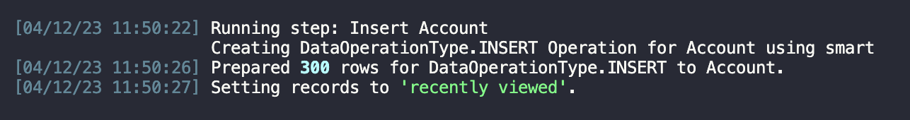
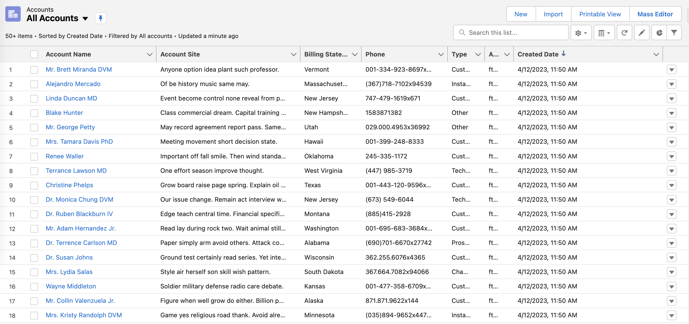

# SFDataFakery

A simple and easy Salesforce data generation tool.

## Installation

1. Install [Visual Studio Code](https://code.visualstudio.com/)
2. Install [SFDX extension for VSC](https://developer.salesforce.com/tools/vscode/)
3. Install [Git](https://git-scm.com/downloads)
4. Install [CumulusCI](https://cumulusci.readthedocs.io/en/latest/get_started.html)

## Setup

**Salesforce Environment**

- Setup [DevHub](https://trailhead.salesforce.com/content/learn/modules/cumulusci-setup/set-up-your-salesforce-environment)

**CumulusCI**

- [Set up CumulusCI](https://cumulusci.readthedocs.io/en/latest/get_started.html)

### Set up scratch org

- Run `cci org scratch dev dev30 --days 30 --default` to create a dev30 scratch org with 30 day expiring setting and set it as a default, If you want to delete dev30 org template run: `cci org remove dev30`
- Run `cci org browser dev30` to open an org named dev30

### Salesforce Account Example

- Run `cci task run generate_and_load_from_yaml -o generator_yaml ./datafakery/salesforce/Account.yml -o num_records 300 -o num_records_tablename Account --org dev30`, Will create 300 salesforce account data. 

    

    

